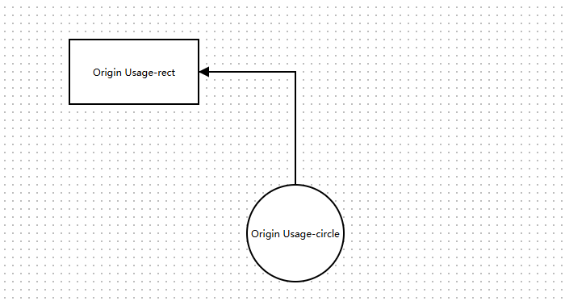
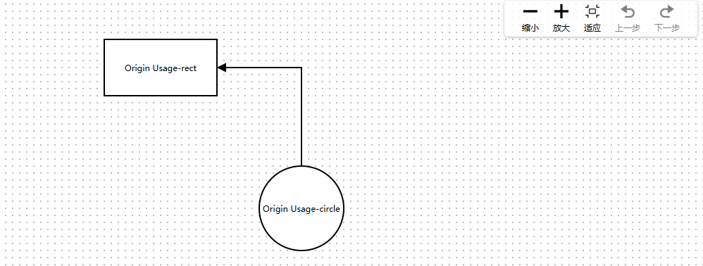

# LogicFlow-前端流程图开发

### 一、安装使用

#### 1、安装logicflow

通过npm安装logicflow

```shell
npm install @logicflow/core --save

# 插件包（不使用插件时不需要引入）
npm install @logicflow/extension --save
```

#### 2、创建实例

```js
  import LogicFlow from "@logicflow/core";
  import "@logicflow/core/lib/style/index.css"; 
  // 初始化实例
  const lf = new LogicFlow({
    container: document.querySelector('#container'),
    // 其他配置
  })
  // 渲染数据
  lf.render({
    // 渲染的数据
  })
```

渲染数据如下：

```json
{
    // 节点数据
    nodes: [
        {
            id: '21', // 节点ID，需要全局唯一，不传入内部会自动生成一个ID
            type: 'rect', // 节点类型，可以传入LogicFlow内置的7种节点类型，也可以注册自定义节点后传入自定义类型
            x: 100, // 节点形状中心在x轴位置
            y: 100, // 节点形状中心在y轴的位置
            text: 'Origin Usage-rect', // 节点文本
            properties: { // 自定义属性，用于存储需要这个节点携带的信息，可以传入宽高以重设节点的宽高
                width: 160,
                height: 80,
            }
        },
        {
            id: '50',
            type: 'circle',
            x: 300,
            y: 300,
            text: 'Origin Usage-circle',
            properties: {
                r: 60,
            }
        },
    ],
    // 边数据
    edges: [
        {
            id: 'rect-2-circle', // 边ID，性质与节点ID一样
            type: 'polyline', // 边类型
            sourceNodeId: '50', // 起始节点Id
            targetNodeId: '21', // 目标节点Id
        },
    ],
}
```

效果如下：



### 二、插件安装使用

如果需要使用插件，开发者需要引入`@logicflow/extension`依赖包，并根据自己的诉求引入插件。

主要使用的插件提供了放大缩小或者自适应画布的能力，同时也内置了 `redo` 和 `undo` 的功能。

使用npm安装后如下引用：

````js
import LogicFlow from "@logicflow/core";
import { Control } from "@logicflow/extension";

// 全局使用 每一个lf实例都具备 Control
LogicFlow.use(Control);
````

效果如下：



### 三、自定义节点

LogicFlow提供了7种类型的节点供继承之后进行重写，这边主要讲解html节点的自定义，因为html节点的可定制性比较高。

自定义节点需要返回三个东西，view、model和type。

#### 1、view重写

继承HtmlNode，重写setHtml方法。这边Component是定义在同文件中的vue组件，可以直接导入一个开发好的组件，这个组件即节点的最终样式。

```tsx
class CustomNode extends HtmlNode {
  setHtml(rootEl: any) {
    const { properties } = this.props.model;
    const node = document.createElement('div');
    node.className = 'logic-flow-node-customnode';
    render(
      <Component properties={properties} props={this.props} key={new Date().getTime()} />,
      node,
    );
    rootEl.innerHTML = '';
    rootEl.appendChild(node);
  }
}
```

#### 2、model重写

继承HtmlNodeModel，重写setAttributes方法。

```tsx
class NodeModel extends HtmlNodeModel {
  setAttributes() {
    // this.draggable = false
    this.width = NODE_WIDTH;
    this.height = 120;
    this.text.editable = false;
  }
}
```

#### 3、导出属性

```tsx
export default {
  type: 'custom-node-mc',
  view: CustomNode,
  model: NodeModel,
};
```

#### 4、注册自定义节点

在创建实例的地方导入自定义的节点，并通过this.lf.batchRegister批量注册。注册后的节点，就可以addNode函数增添节点，在type中填入自定义的type即可。