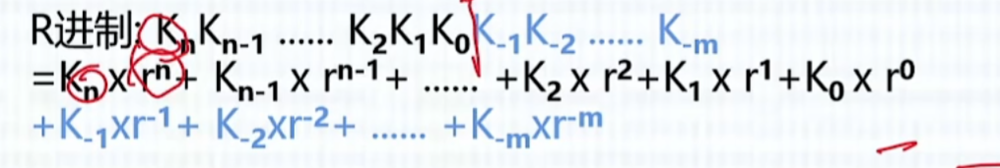
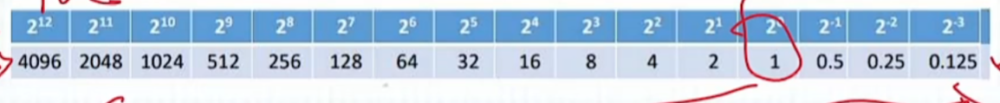
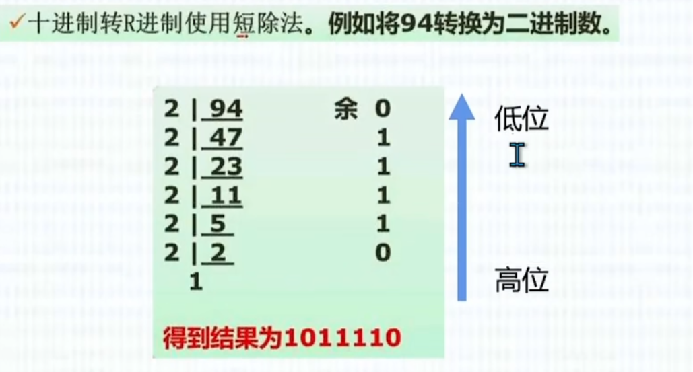
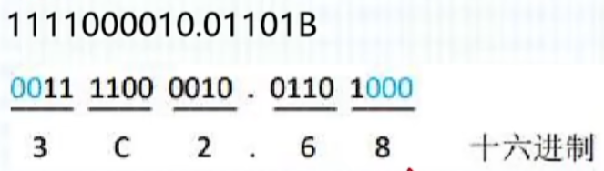
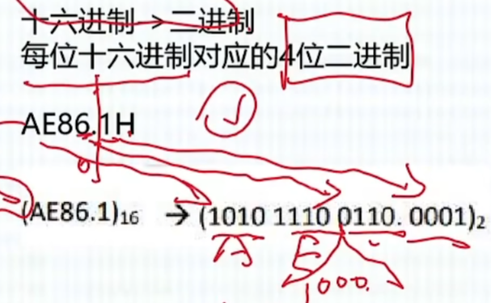
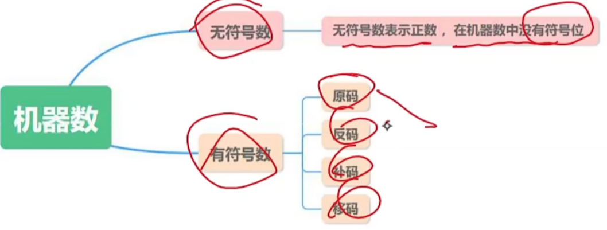
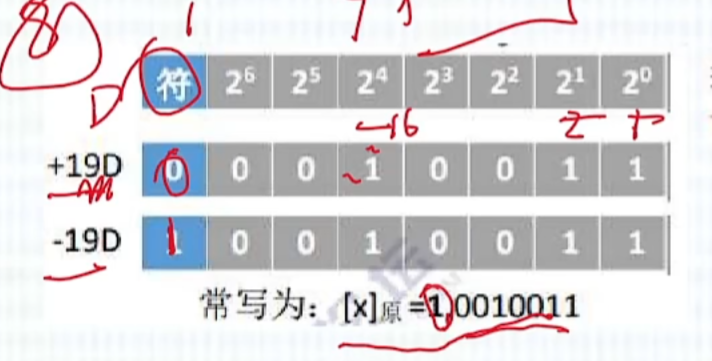
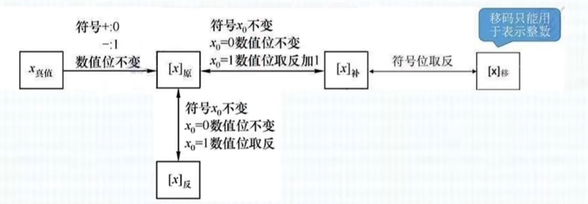
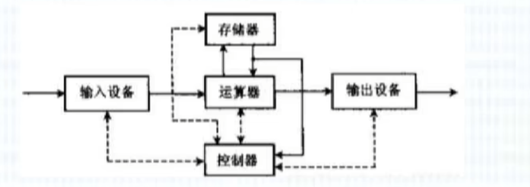

# 软件设计师理论学习

### 一、基础阶段

#### 1.数值转换（进制转换）

进制表示： BODH -> 二八十十六

##### 任意进制 -->  十进制：

*2的指数数值表（建议背）

##### 十进制 -->  任意进制：

使用短除法

##### 二进制  -->  十六进制：

四位一组进行转换，从小数点分割，左数四位不足前面补零，右数四位不足后面补零

##### 十六进制  -->  二进制：

一位对应四位，小数点右边前面补零

#### 2.真值与机器数

真值：无符号，符合人类习惯

机器数：正负号需要数字化，另起一位代表正负，0为正1为负。

##### **原反补移码

原码：若机器字长为n+1位，则数值部分占n为,表示范围为
$$
-(2^n-1) <=x<= 2^n-1
$$

反码:符号位为1即负数则数值位全部取反

补码：负数补码为反码末位加一，要考虑进位，补码表示范围
$$
-2^n <= x <= 2^n-1
$$
移码：补码的基础上将符号位取反，表示范围与补码相同。

注：正数的原反补码均相同，移码更改符号位即可。

#### 3.定点数 VS 浮点数

##### 定点数

​	小数点位置固定不变，整数在最低有效数值位之后，小数在最高有效数值之前

##### 浮点数

浮点数小数点位置不固定，能表示更大范围的数，计算公式：

最终的数值 = **符号位 × (1.尾数) × 2^(指数 - 偏移量)**

假设32位浮点数的二进制是：
`0 10000001 10100000000000000000000`

- **符号位**：`0` → 正数
- **指数位**：`10000001` → 十进制 129 → **实际指数 = 129 - 127 = 2**
- **尾数位**：`10100000000000000000000` → 实际尾数 = **1.101**（二进制）

#### 4.校验码

为保证数据在传输过程中不出错：

+ 提高硬件可靠性
+ 提高代码校验能力

码距：一个编码系统中任意两个合法编码之间至少有多少个二进制位不同

##### 奇偶校验码

​	**奇偶校验码只可以做到发现错误**。通过增加一位校验码来使得编码中1的个数变为奇数（奇校验）或者偶数（偶校验），奇校验只能校验奇数位发生的错误，偶校验只能校验偶数位发生的错误。

##### 循环冗余校验码

​	非重点

##### **海明码

**既可以检错也可以纠错**。在数据中插入多个校验位，分布在数据位的特定位置，用于检测一部分数据位。设数据位是n位，校验位是k位，则n和k必须满足以下关系： 
$$
2^k-1 >= n+k
$$
做选择题时使用二分法带入公式验证。

#### 5.计算机系统组成（五大部件）

输入、输出、存储、运算、控制。运算和控制合并为CPU。

输入设别将信息转换为机器能识别的形式。输出设备将结果转换人能理解的数据形式。

##### 主存储器

> ​	由存储体和两个寄存器MAR、MDR组成。

名词解释：

+ 存储单元：每个存储单元存放一串二进制代码

+ 存储字：存储单元中二进制代码的组合
+ 存储字长：存储单元中二进制代码的位数
+ 存储元每个存储元可存8bit