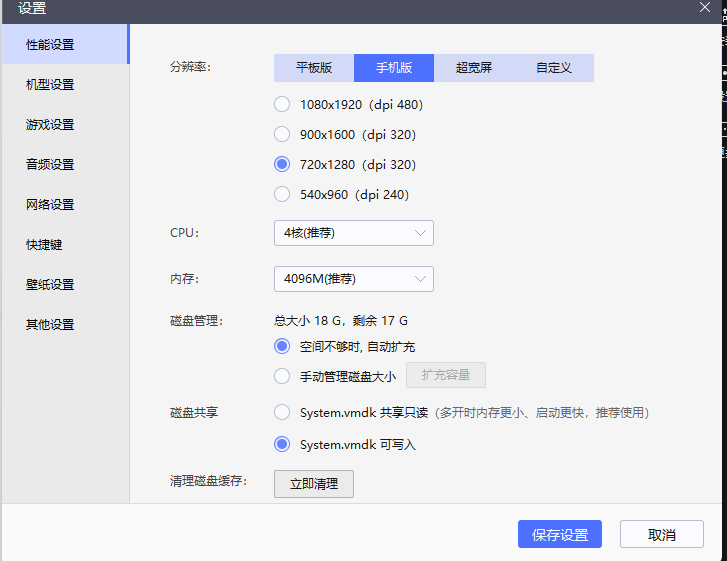
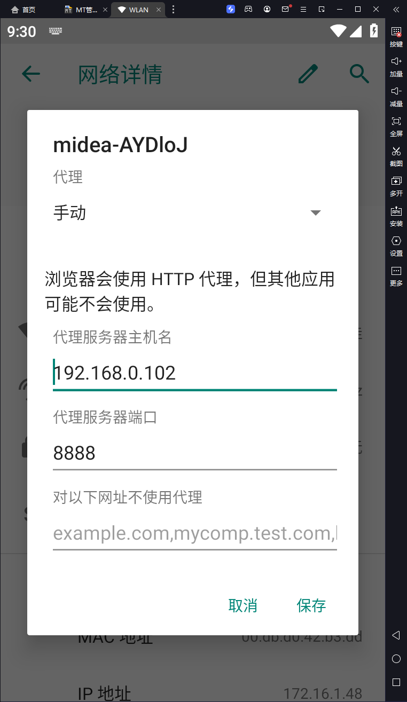

# 模拟器抓包

### 一、fillder + 雷电

​	电脑启动fillder，打开雷电模拟器，雷电9配置System.vmdk可写入，开启Root权限，adb调试。



​	wlan设置中右上角编辑设置代理指向fillder



​	然后使用浏览器访问fillder端口，下载证书，在设置-安全凭证中-从sd安装中安装ca证书。

​	电脑使用以下命令将证书移动到系统目录

```shell
adb root
adb remount
adb shell
su
# 查看证书文件名
ls /data/misc/user/0/cacerts-added/
269953fb.0
# 移动证书
mv /data/misc/user/0/cacerts-added/269953fb.0 /system/etc/security/cacerts/

# 给可读权限
chmod 644 /system/etc/security/cacerts/269953fb.0

9、设置为全局代理（重要）
adb.exe shell settings put global http_proxy 192.168.0.102:8888
```

这时候再打开浏览器访问网站就不会有证书警告了。

### 二、fillder + mumu

> ​	都不用证书直接可以抓？
